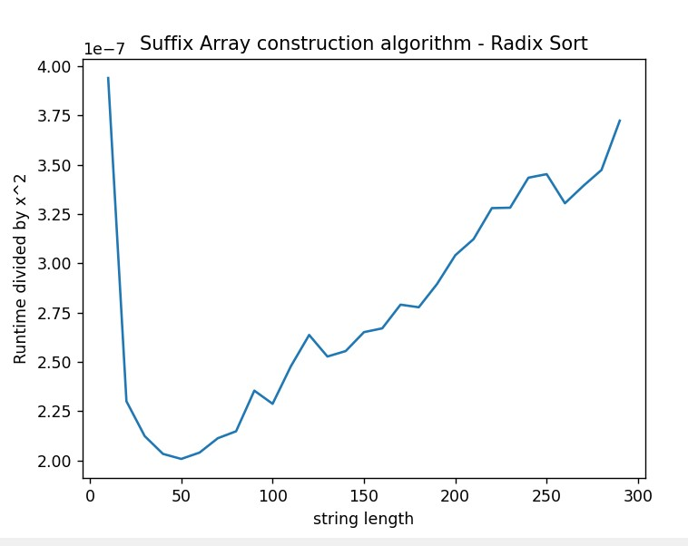
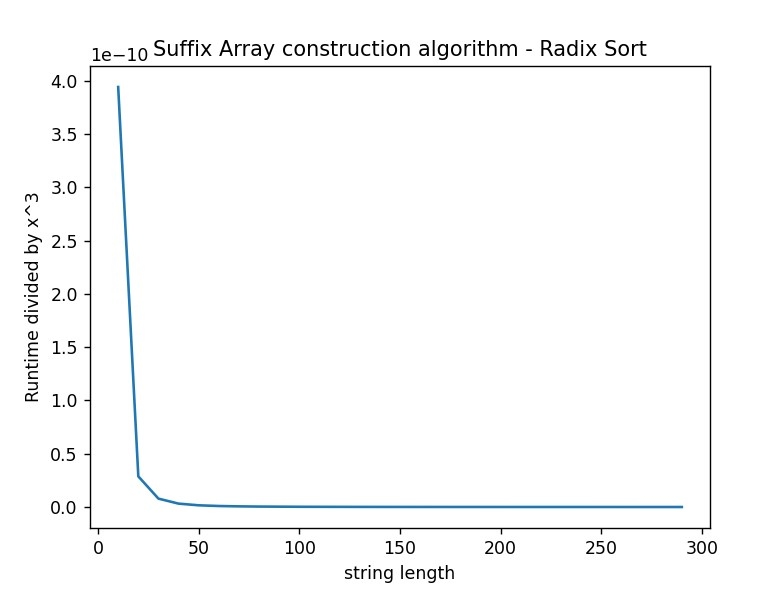
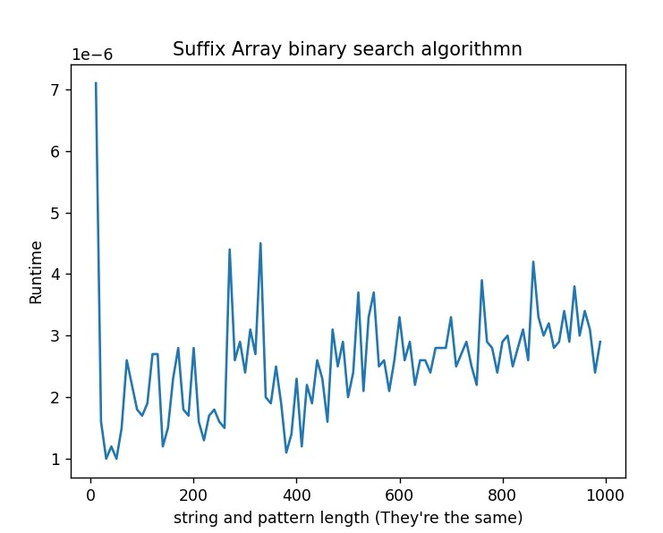

# Project 3: Suffix array construction

You should implement a suffix array construction algorithm. You can choose to implement the naive O(n² log n)-time construction algorithm based on just sorting all the suffixes using a comparison based algorithm, the O(n²) algorithm you get if you radix sort the suffixes, or you can use the suffix tree from project 2: If you run through the suffix tree, and traverse children in lexicographical order, you will see each leaf in lexicographical order as well, and if you collect all the leaf-labels you have your suffix array.

If you feel adventurous, you are also welcome to implement one of the linear time algorithms *skew* or *SAIS* that we will see the next two weeks, but then you will have to read a bit ahead.

Once you have constructed a suffix array you should use it to implement a binary-search based exact pattern matching. Since I haven’t taught you have to do it faster, it should run in O(m log n + z) where m is the length of the pattern, n is the length of the genome string, and z is the number of matches you output. (One of the algorithms you have seen multiplies z by m, but you know how to avoid this).

Implement the suffix array construction and the exact pattern matching in a single program called `sa`.  The program should take the same options as in project 1, so `sa genome.fa reads.fq`. The program should output (almost) the same Simple-SAM file. Because a search in a suffix array is not done from the start to the end of the string the output might be in a different order, but if you sort the output from the previous project and for this program, they should be identical.

## Evaluation

Once you have implemented the `sa` program (and tested it to the best of your abilities) fill out the report below, and notify me that your pull request is ready for review.

# Report

## Algorithm

The radix sort was the algorithm used to construct the suffix array. The running time is O(n^2) where n is the length of the string.

## Insights you may have had while implementing the algorithm

## Problems encountered if any

## Validation

*How did you validate that the construct and the search algorithm works?*

## Running time

Because radix sort is a non-comparative sorting algorithm, the runtime is not affected if the suffixes are already ordered. To prove the time complexity of the algorithm, experiments were run with strings of varying length, and then plotted in a graph where the running time was divided by the expected complexity.

The line chart now looks like it is linear, however I'm not 100% convinced so to test if the time complexity is not O(n^3), the runtime was divided by said complexity.

The resulting figure proves that its running time is lower than O(n^3).

For the search the worst case is when all characters are the same in the string, and the pattern. Which should be O(m*log(n)+z) where z is the number of occurrences found, m is the length of the pattern and n the length of the string.

The resulting figure corroborates the complexity.
